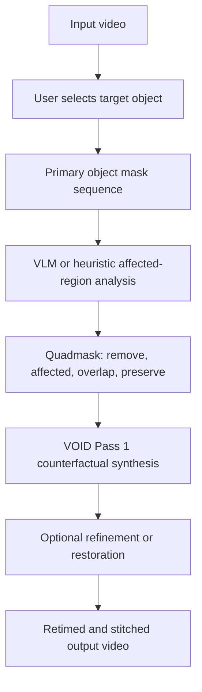

# The Three Failure Surfaces in Netflix's VOID Model Nobody Warned Me About

> Local demo video: [comparison.mp4](../comparison.mp4)
>
> Medium/Towards Data Science note: upload `comparison.mp4` as a native Medium video block and place it after this opening section.

<video src="../comparison.mp4" controls width="100%"></video>

The first failed result looked worse than the input. The target object was technically "removed", but the video had lost too much detail, the output duration was wrong, and the masked region left enough visual confusion that the edit did not read as a clean before-and-after. In a less crowded clip, the same pipeline looked promising. In a harder human scene, the model behaved as if the instruction "remove this person" had quietly become "modify whatever visual region the tracker happened to follow."

That failure was useful. It changed the project from a model-integration task into a diagnostic exercise.

VOID, short for Video Object and Interaction Deletion, is one of the most interesting recent systems for video object removal because it is not just trying to fill a hole behind an object. The paper frames object removal as a counterfactual generation problem: if an object disappears, the world around it may also need to change. A held object may fall. A collision may never happen. A shadow or reflection may vanish. To train this behavior, the authors generate paired counterfactual videos from Kubric simulations and the HUMOTO human motion dataset. During inference, a vision-language model expands a user object mask into an interaction-aware quadmask, then a video diffusion model generates the edited video.

The headline result is impressive. In the paper's human preference study on 75 real-world edits, VOID is selected 64.8% of the time, ahead of Runway at 18.4% and multiple video inpainting baselines. But benchmark numbers are only valid inside the assumptions that produced them. VOID assumes that the object mask and affected-region mask are good enough to condition the model. In my tests, the hard part was not only inpainting. It was everything around inpainting: resolution handling, identity tracking, quadmask semantics, prompt specificity, and chunk timing.

This article is a postmortem of those three failure surfaces and the architecture I built around them. I cannot share the full production code, but the patterns are general enough to be useful: diagnose the mask before blaming the model, separate identity tracking from segmentation, and treat quadmask generation as a first-class research problem.

## The Research Landscape

Video object removal has moved through several eras. Classical approaches such as OpenCV inpainting are useful for small, static defects, but they break down once the object moves, the background changes, or temporal consistency matters. The next wave of methods, including E2FGVI and ProPainter, made video inpainting more coherent by using flow, propagation, and transformer-style reasoning. More recent diffusion-era systems, including DiffuEraser, VACE, EraserDiT, and VOID, push toward higher quality generation and more semantic control.

VOID is different because its conditioning is richer than a binary mask. Its paper extends the trimask idea into a quadmask. The model receives four pixel classes: the primary object to remove, affected regions, overlap between the object and affected region, and background that should be preserved. That matters because removal is often not local. The object is only one part of the causal edit.

At a high level, the pipeline looks like this:



The research gap I ran into is not that VOID is weak. It is that VOID starts from a mask sequence. The paper's core contribution is counterfactual video synthesis given meaningful conditioning, not persistent target identity tracking in crowded real-world footage. If the mask follows the wrong person, includes the neighbor, or ignores a contact shadow, the diffusion model receives a corrupted instruction.

## Failure Surface 1: Quality Degradation

The first failure surface was visual quality. In my runtime configuration, the highest practical profile used 384x672 generation, with lower-memory profiles at 256x448 or 192x320. This is understandable for a large video diffusion model, but it creates a production problem: most source footage is much larger.

Downscaling is not neutral. Fine texture, face detail, small text, floor patterns, and compression edges are all destroyed before the model ever sees the clip. A naive FFmpeg upscale can restore the frame size, but it cannot restore the lost information. It often makes the output feel softer than the original, even when the removal itself is plausible.

The tempting fix is Real-ESRGAN. It can sharpen individual frames, and for still images that is often good enough. For video, frame-independent upscaling introduces a second problem: temporal flicker. Each frame is enhanced without knowing what the previous and next frames did, so small hallucinated details change over time. The result can be sharper but less stable.

The better direction is video enhancement, not image enhancement repeated N times. VEnhancer-style restoration is attractive because it treats super-resolution as a spatial and temporal problem. The distinction is important: spatial super-resolution asks, "What detail should this frame contain?" Video super-resolution asks, "What detail should this evolving sequence contain consistently?"

The second quality bug was duration. Chunked diffusion outputs can carry wrong timestamps or playback rates. I saw cases where the pixels looked usable but the clip duration was wrong after stitching. The fix was not glamorous: validate every chunk's width, height, FPS, frame count, and expected duration, then rewrite output timing before final stitching. This is the kind of engineering detail papers rarely discuss, but it determines whether a research model can become a usable pipeline.

```text
Original video
  -> downscale for VOID inference
  -> low-resolution VOID output
  -> retime and resize each chunk
  -> video-aware restoration
  -> stitched comparison output
```

The lesson: if quality degrades everywhere, do not only inspect the inpainted region. Inspect the resolution chain.

## Failure Surface 2: Human Identity Tracking in Crowded Scenes

This was the strongest failure and the most important architectural lesson.

SAM2 and SAMURAI are strong visual tracking and segmentation tools, but they do not inherently solve identity preservation in crowds. In sparse scenes, tracking a region from a selected ROI can be enough. In crowded scenes, multiple people may cross, occlude each other, wear similar clothing, or overlap inside the selected region. The tracker may switch identities during a crossing event, merge two nearby people, lose the target during occlusion, or expand the target mask into a neighbor's limb.

Once that happens, VOID is already doomed. A better prompt cannot reliably fix a wrong primary mask. A stronger diffusion model cannot know that the mask accidentally moved from person A to person B.

The architecture that worked better was detection-first:

```text
YOLO person detection
  -> BoT-SORT with ReID identity tracking
  -> selected track from the user's ROI
  -> SAM2 image-prompt silhouette refinement
  -> neighbor-person exclusion
  -> mask cache
  -> VOID quadmask export
```

Each model has a separate job. YOLO answers, "Where are the people?" BoT-SORT with ReID answers, "Which detection is the same person over time?" SAM2 answers, "What is the silhouette of that person in this frame?" VOID answers, "What should the video look like if this masked person and affected regions were removed?"

This separation matters. It is tempting to collapse tracking and segmentation into one model, but crowded scenes punish that shortcut. ByteTrack-like IoU tracking can work when motion is clean, but crossing events break the assumption that the nearest box is the same identity. BoT-SORT adds camera motion compensation and a ReID appearance embedding, which connects directly to the requirement we care about: identity preservation. The IDF1 metric is useful precisely because it measures whether the same identity is maintained across time, not merely whether boxes overlap frame by frame.

The neighbor exclusion layer was also important. If the target is person 12, non-target person regions should be subtracted from the target mask before VOID sees it. I used conservative thresholds because over-excluding is safer than removing a neighbor's body part in a public demo. The goal is not to produce the fattest possible mask. The goal is to remove exactly the selected identity.

SAMURAI and DAM4SAM were useful stepping stones. They improved motion-aware propagation, but the deeper issue was not propagation alone. It was semantic identity under crowd pressure.

## Failure Surface 3: Quadmask Conditioning and Prompt Quality

Most video object removal examples treat the mask as binary: remove this, preserve everything else. VOID's quadmask makes that assumption too simple.

In the VOID format, pixel values encode different instructions. In my implementation, the mapping is:

| Value | Meaning |
| --- | --- |
| 0 | Primary target to remove |
| 63 | Primary and affected-region overlap |
| 127 | Affected interaction region |
| 255 | Background to preserve |

This matters because a person is not just a silhouette. They have shadows, floor contact, reflections, carried objects, and sometimes occlusion relationships with nearby people. A binary mask tells VOID nothing about which nearby pixels are allowed to change.

The first affected-region implementation was deliberately heuristic. A downward dilation captured likely floor contact and shadow regions. A smaller uniform dilation captured boundary effects around the body. The primary region was excluded from the affected-only mask, so the grey region did not silently expand the identity being removed. This is critical in crowds: the affected region may be allowed to change, but neighboring people must remain preserved.

Prompting also improved once it became scenario-specific. A generic prompt such as "clean natural background after the selected object is removed" is too weak for crowded scenes. Better prompts describe constraints:

```text
Remove only the selected target person. Preserve every other person,
limb, clothing item, object, floor texture, lighting, camera motion,
and background layout. Reconstruct the occluded background naturally
without duplicate bodies, ghost limbs, or changes to neighboring people.
```

For a person with a shadow, the prompt should explicitly allow shadow/contact removal. For a person carrying an object, the prompt should specify whether the carried object is integral to the removal or should remain. This is not cosmetic prompt engineering. VOID is text-conditioned, and the text helps define the counterfactual.

A VLM can make this richer. The official VOID pipeline uses a VLM to identify affected objects and regions. I still prefer heuristics as the default fallback because they are deterministic, cheap, and do not require a cloud model. VLM reasoning is valuable, but only after the primary target mask is reliable.

## Lessons and Reflections

The biggest lesson is to read the data and conditioning sections of papers as carefully as the results table. VOID's 64.8% human preference result is meaningful, but it does not mean every integration will work on every crowded video. It means VOID performed strongly under its evaluated setup, with appropriate masks and interaction-aware conditioning.

The second lesson is diagnostic sequencing: fix the mask before debugging the inpainting. My first instinct was to compare models. That was the wrong order. If the mask is wrong, all downstream models are answering the wrong question.

The third lesson is architectural layering. Detection, tracking, segmentation, quadmask construction, inpainting, restoration, and retiming are different responsibilities. Treating one model as responsible for all of them hides failure causes. Splitting them makes the system easier to debug.

Several problems remain unsolved. VOID's practical resolution ceiling still matters. Long-video inference remains expensive. Heuristic affected regions cannot fully understand complex physical interactions. A VLM can help, but introduces latency, cost, and reproducibility concerns. Crowded human removal is still a research problem, not a solved feature.

## Closing

The final pipeline became less like "run VOID on a video" and more like a diagnostic stack: user ROI selection, identity-aware person tracking, SAM2 silhouette refinement, neighbor exclusion, heuristic affected-region generation, VOID-compatible quadmask export, chunked diffusion inference, timing normalization, and video-aware restoration.

That stack enables something more useful than a polished demo clip. It makes failure visible. When a result fails, I can now ask whether the cause was identity drift, boundary leakage, missing affected regions, prompt ambiguity, resolution loss, chunk timing, or diffusion hallucination.

For me, that is the real research value. State-of-the-art models are powerful, but they are rarely plug-and-play at the edge of their training distribution. The work is in discovering where the assumptions break and designing enough instrumentation to see the breakage clearly.

If you have integrated a strong research model into a real workflow, what was the first hidden assumption that failed?

## References

- Motamed et al., "VOID: Video Object and Interaction Deletion", arXiv:2604.02296, 2026.
- Zhou et al., "ProPainter: Improving Propagation and Transformer for Video Inpainting", 2023.
- Li et al., "E2FGVI: Towards An End-to-End Framework for Flow-Guided Video Inpainting", 2022.
- Liu et al., "DiffuEraser: A Diffusion Model for Video Inpainting", 2025.
- Cheng et al., "Segment Anything Model 2", 2024.
- Aharon et al., "BoT-SORT: Robust Associations Multi-Pedestrian Tracking", 2022.
